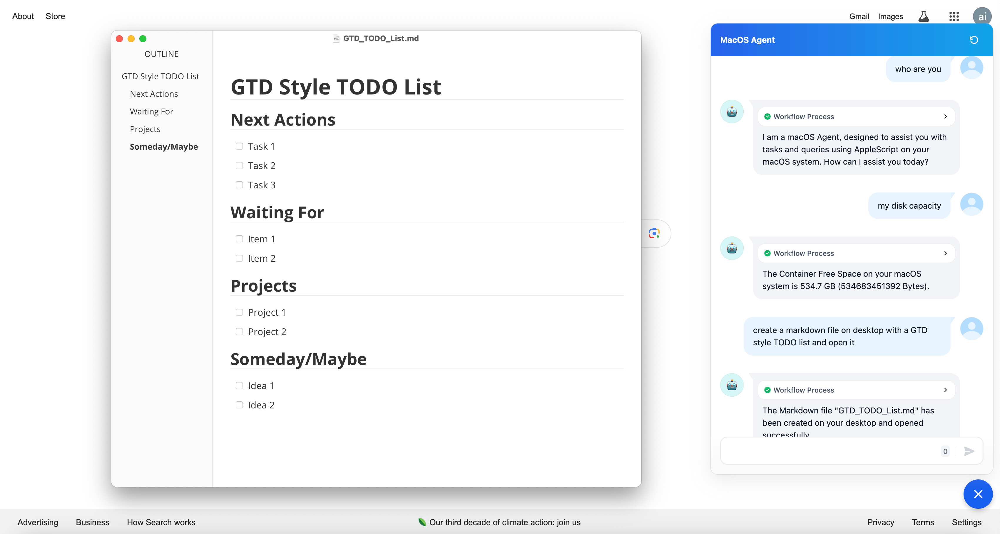
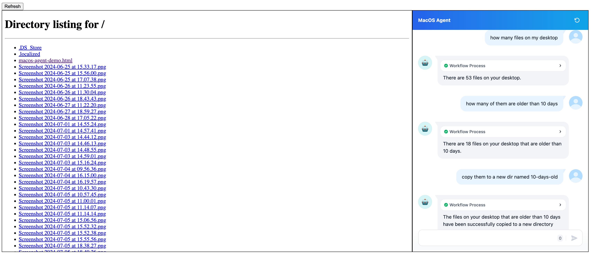
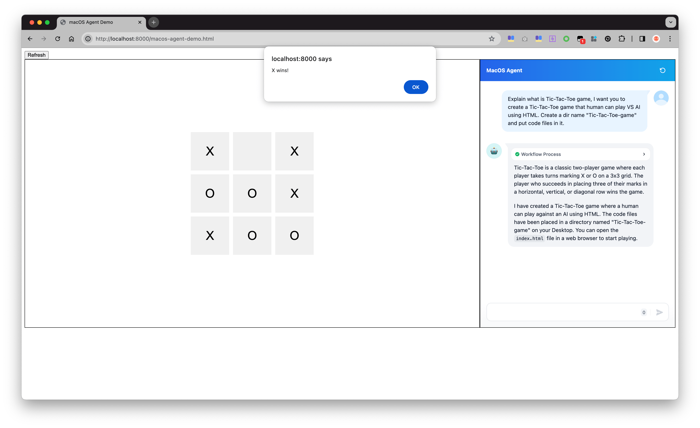
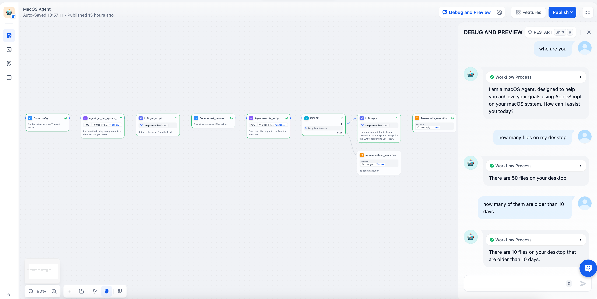
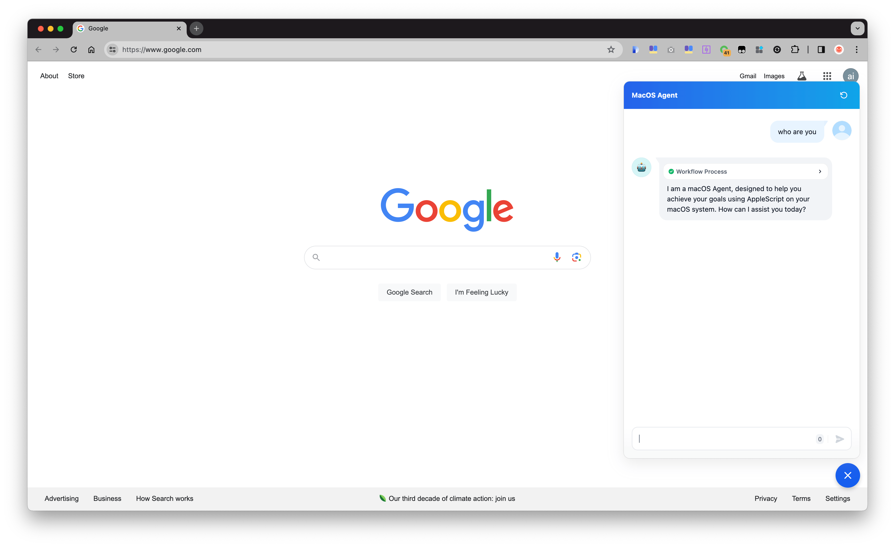

# MacOS Agent: A Simplified Assistant for Your Mac

The MacOS Agent is a straightforward, lightweight solution based on a Large Language Model (LLM) that leverages Dify, an AI application development platform. This agent enables users, even children, to control MacOS with ease using natural language commands, making it as simple as conversing with a tech expert.



While it may sound similar to Siri, the MacOS Agent offers enhanced capabilities, particularly through its support for multiple rounds of conversation, allowing users to maintain context and continuity in their tasks. For instance, you can ask the Agent to provide some text and then request it to convert that text into an Excel or Word file.



## Use Cases

Here are some use cases I tried:

### Query OS Info

- what is the memory usage
- unused memory
- disk usage
- my disk capacity
- how many spaces left on my computer
- time since boot
- last boot time
- what is the CPU temperature
- list ports opened

### Query Network Info

- lan ip
- list devices in local LAN

### Ask computer to do something for you

- take a screenshot
- open a new text file
- create text file on desktop and open it
- create a markdown file on desktop with a GTD style TODO list and open it
- move all files on desktop to a temp dir
- how many files older than 10 days in ~/Desktop
  - copy them to a new dir named "10-days-old" in that dir
- list files older than 10 days in ~/Desktop
  - create an Excel file contains the file name and create time
- check ~/Desktop/macos-agent-playground.html and explain what it does

### Create utility tool

- give me a shell script that can watch an app's memory usage by app name when it reaches a threshold then restart it
- give me an Automator app that can watch an app's memory usage by app name when it reaches a threshold then restart it

### Remind you something

- remind me to clock in after 5 seconds
- wait 5 seconds then send me a message with "Timeup"
- send me a message "Call someone" at 18:54
- display an alert "Call someone" at 19:01
- alert me about "Do something" at 18:58

### Control process

- run `top` command # for testing timeout control
- find all processes which name is "top"
- find all processes which name is "top" and kill them
- restart app XXX

### Control computer settings

- open system settings
- turn dark mode on/off

### Query Internet

- what's my internet IP
- show me the price of BTC/Gold

### Interact with Siri

- ask Siri for what is the weather like tomorrow
- ask Siri for what ...

### Math calculation

* 9.11 and 9.9——which is bigger?
  run code to compute the result
* If a banana weighs 0.5 pounds, I have 7 pounds of bananas and 9 oranges, how many fruits do I have in total?
  run code to compute the result

###  Acts as Code playground

 Notes: The outcome of this scenario depends on the performance of the  LLM

- run a http server on ~/Desktop in the background

  Tips: to quit: `quit http server on port 8000`

- create a html file named "macos-agent-playground.html" that having 2 iframe pages.
  which iframe "desktop-page" is 70% width and iframe "agent-page" is 30%; both using frameborder=1, style="width: 100%; height: 100%; min-height: 700px".
  iframe "desktop-page" url is "http://localhost:8000/", with a "refresh" button at top that can reload the the url
  iframe "agent-page" url is "${chat app Embed on website using iframe url}".

- Explain what is Tic-Tac-Toe game, I want you to create a Tic-Tac-Toe game that human can play VS AI using HTML. Create a dir name "Tic-Tac-Toe-game" and put code files in it.



## Demo Video

- macos-agent-brief-demo

https://github.com/user-attachments/assets/d4a2a911-db7f-435b-9f8f-3e72eada9cd3


- macos-agent-file-management-demo

https://github.com/user-attachments/assets/b707c65f-4f95-4bfa-8a12-63ce66265b00


- macos-agent-code-playground-demo

https://github.com/user-attachments/assets/35d8695f-f24b-4846-8711-d8befee1a437


## How It Works

The MacOS Agent operates through a series of steps:

1. **Run the `macOS Agent Server`:** This server returns a system prompt for the LLM, including the Agent's role profile, environment information, and knowledge base.

2. **Set up the `LLM:get_script` node:** This node uses the system prompt to have the LLM act as a "macOS Agent," tasked with achieving user goals using AppleScript.

3. **Send User Input:** The user's goal is sent to the `LLM:get_script` node to receive suggestions, including executable AppleScript.

4. **Execute AppleScript:** The LLM output is sent to the `macOS Agent Server`, which extracts and runs the AppleScript, returning the execution result.

5. **Formulate Response:** The execution result is combined with the user's goal and LLM output into a `reply_prompt` for a comprehensive response.

6. **Respond to User:** A `LLM:reply` node uses the `reply_prompt` to respond to the user.


## Deployment

### Deployment Steps Summary:

The agent is compatible with both locally-hosted instances of the Dify platform (cloud-hosted not tested).

1. Clone the Repository
2. Start the Agent Server
3. Import Chatbot Configuration
4. Configure the Chatbot
5. Publish the Chatbot

### Deployment Step by Step

#### Step 1: Clone the Repository

```bash
git clone https://github.com/rainchen/MacOS-Agent.git
```

File list:

- **README.md:** This documentation file
- **macos_agent_server.py:** Script to run the `macOS Agent Server`
- **MacOS Agent.yml:** Configuration file for importing into Dify as a Chatbot app
- **knowledge.md:** File for extending the Agent's knowledge
- **test.sh:** Script for running test cases to verify agent server functionality

#### Step 2: Start the Agent Server

No additional installations are required as the code is designed to work with MacOS's built-in Python version and standard libraries.

```bash
python macos_agent_server.py --port 8088 --apikey "a-secret-key" --debug
```

Arguments:

- `--port`: Port number for the server
- `--apikey`: API key for authorization
- `--debug`: Optional; enables detailed logging

**Note:** Ensure the server is only run on a Mac you have control rights to, and never expose the `--apikey` publicly.

#### Step 3: Import the Chatbot DSL YAML

Navigate to the Dify Studio homepage, click "Import DSL file" and select "MacOS Agent.yml" file from the cloned repository.

#### Step 4: Configure the Chatbot

Configure the `Code:config` node with details such as the agent API endpoint, API key, and script timeout. Also, set the LLM models for the `LLM:get_script` and `LLM:reply` nodes.

Here is the example config for `Code:config` node:

```
"agent_api_endpoint": "http://host.docker.internal:8088",
"agent_api_key": "a-secret-key",
"script_timeout": 60
```

Options explain:

- `agent_api_endpoint`: when Dify is deployed using docker-compose, port is same as `--port`, e.g.: `:8080`, `http://host.docker.internal:8088`
- `agent_api_key`: same as `--apikey` used in [start agent server], e.g.: `a-secret-key`
- `script_timeout`: control max executing time of a script, 60 seconds recommend

#### Step 5: Publish the Chatbot

Click "Publish" and then "Update" to make the chatbot live.



## How to Use

After publishing, click [Run App] to open the Chatbot web view, input your goals, and refer to the "Use Cases" section for guidance.

Recommended to run `Embed on website` and install [Dify Chatbot Chrome Extension](https://chrome.google.com/webstore/detail/dify-chatbot/ceehdapohffmjmkdcifjofadiaoeggaf), so that you can activate the Agent on any page.



## Extending Agent's Knowledge

Edit the `knowledge.md` file to add more instructions in the same Markdown format and restart the server.

## Development & Testing

Run the `test.sh` script to verify the server's functionality after making any code changes.

```
sh test.sh --api http://localhost:8088 --apikey a-secret-key
```


## Forbidden Actions

Certain actions are restricted, such as deleting/removing files or shutting down the computer or the Mac Agent Server process.

## Acknowledgments

- **Chatbot management and UI**: Dify, powerful and convenient  AI application development platform.
- **Code Generation:** 90% of the project's code was generated by AI(deepseek-coder LLM)
- **Document Polishing:** Assistance in refining the documentation by AI(deepseek-chat LLM)

## License

This project is licensed under the MIT License.
